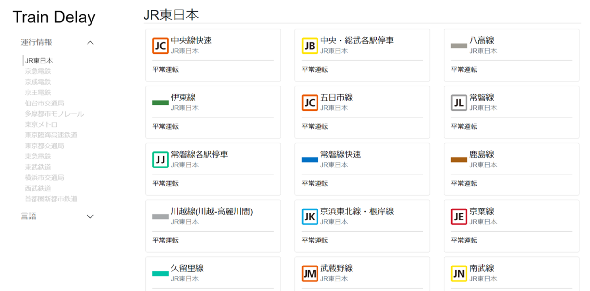
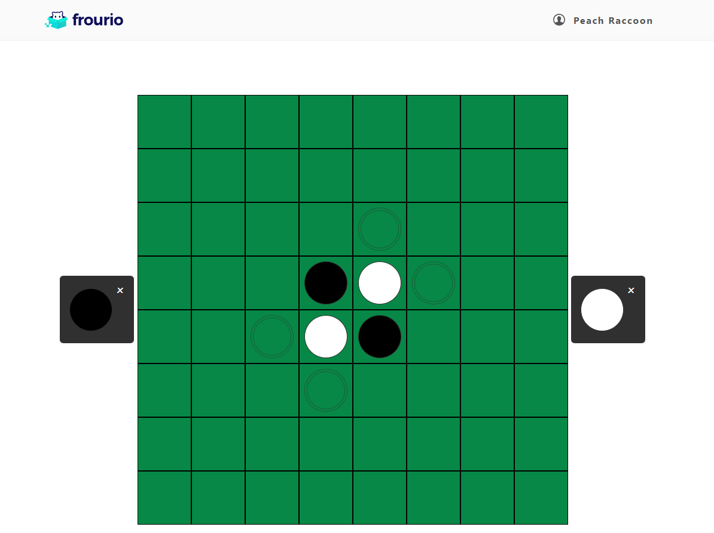
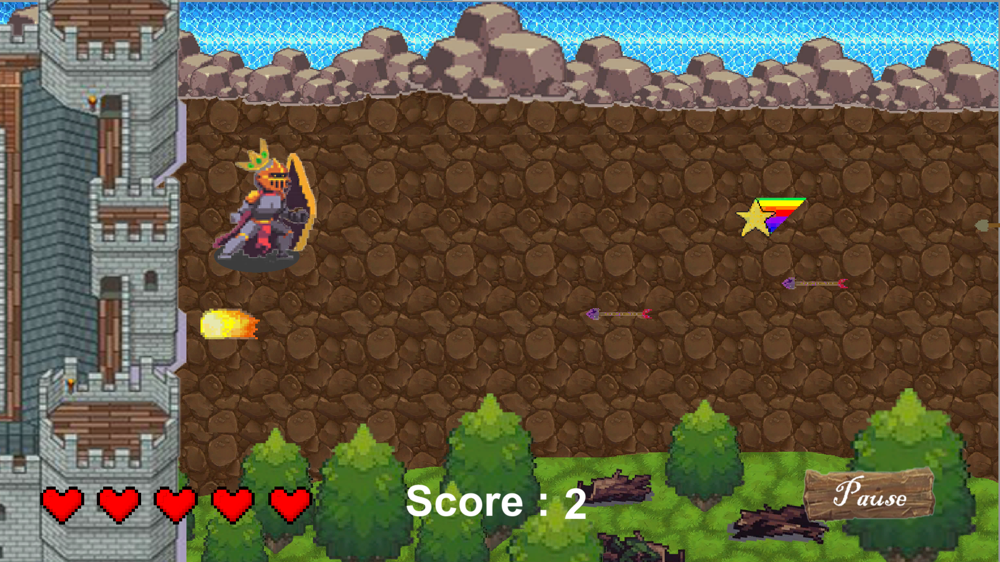
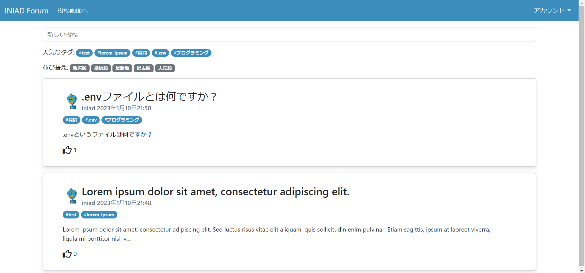
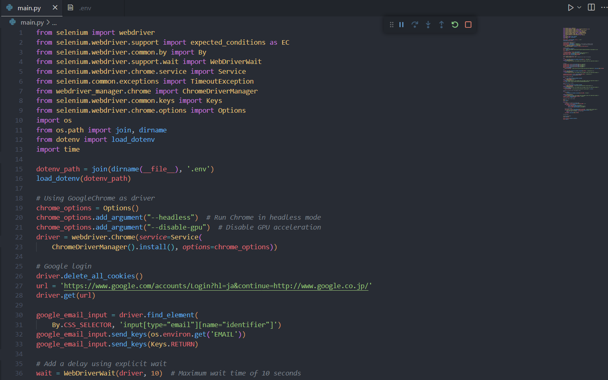

# Chanon Limpipolpaibul

Hello there! I'm a 3rd-year Computer Science student and a passionate full-stack developer. I have a strong interest in building web applications and solving real-life problems.

## Tech Stack

#### Programming Languages

    

#### Frontend Development

    

#### Backend Development

   

#### Databases

    

#### Other Technology

     

## Activities

## Portfolio

<table>
  <tr>
    <th>
      
    </th>
    <th>
      
    </th>
  </tr>
  <tr><td>Tokyo Train Delay</td><td>Online Othello</td></tr>
</table>

<b>See more...</b>

<table>
  <tr>
    <th>
      
    </th>
    <th>
      
    </th>
  </tr>

  <tr><td>Camelot</td><td>Minesweeper</td></tr>
  
  <tr>
    <th>
      
    </th>
    <th>
      
    </th>
  </tr>
  <tr><td>INIAD Forum</td><td>INIAD MOOCs Note Automation</td></tr>
</table>

