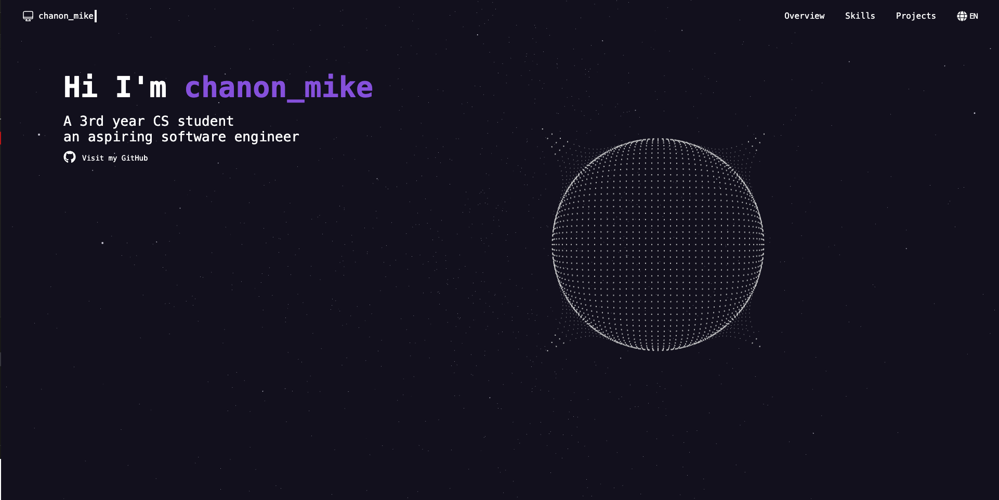
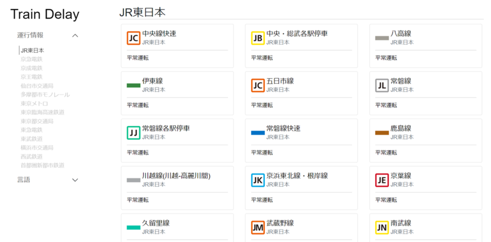
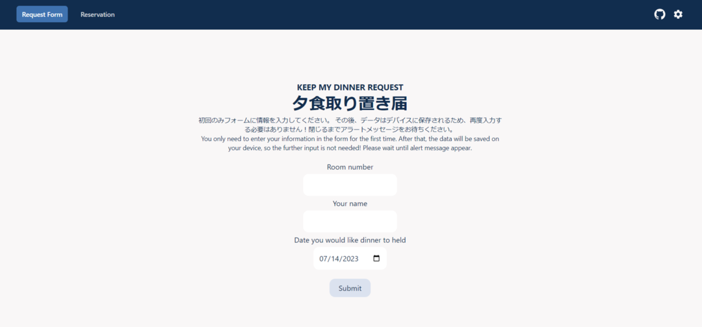
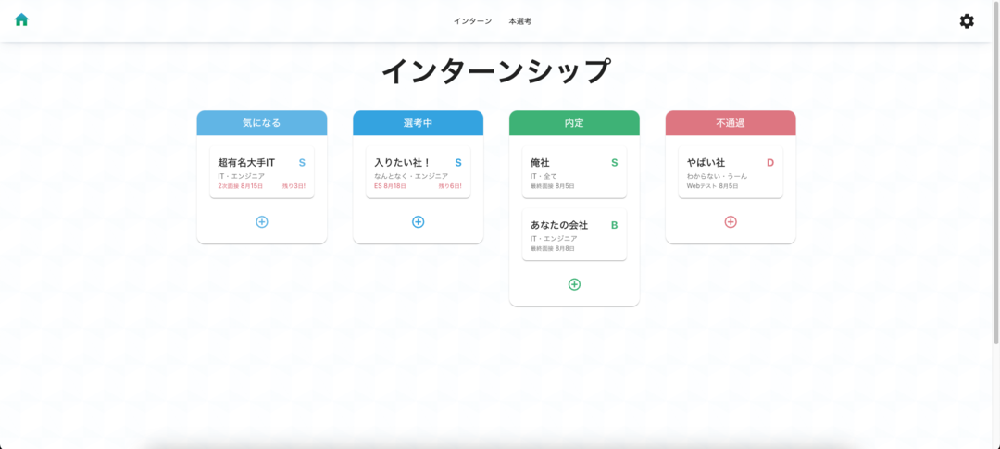
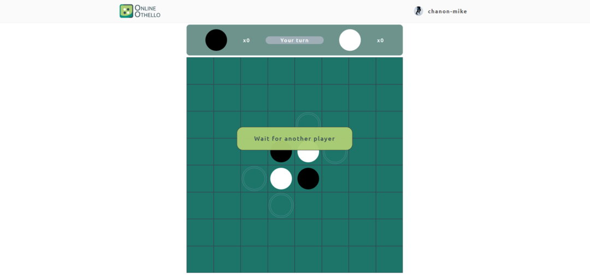

# Chanon Limpipolpaibul

Hello there! I'm a 3rd-year Computer Science student and a passionate full-stack developer. I have a strong interest in building web applications and solving real-life problems.

**🎃 Currently participating in hacktoberfest!!**

[Visit my Portfolio](https://chanon-mike.vercel.app/)

## Activities

## Portfolio

<table>
  <tr>
    <th>
      
    </th>
    <th>
      
    </th>
  </tr>
  <tr><td>Tokyo Train Delay</td><td>AI-House Automation</td></tr>

  <tr>
    <th>
      
    </th>
    <th>
      
    </th>
  </tr>
  <tr><td>Naitei Journey</td><td>Online Othello</td></tr>
</table>

<b>See more...</b>

<table>
  <tr>
    <th>
      
    </th>
    <th>
      
    </th>
  </tr>

  <tr><td>Camelot</td><td>Minesweeper</td></tr>
  
  <tr>
    <th>
      
    </th>
    <th>
      
    </th>
  </tr>
  <tr><td>INIAD Forum</td><td>INIAD MOOCs Note Automation</td></tr>
</table>

